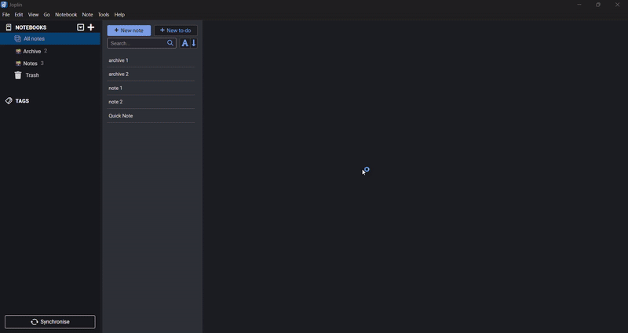
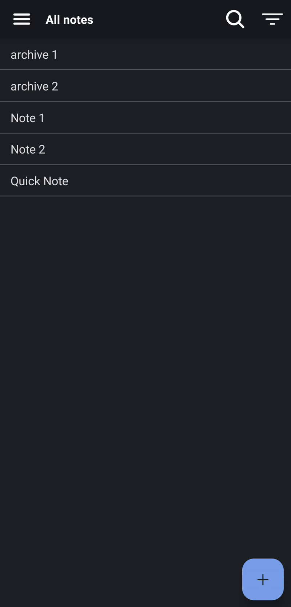

# Quick Note Plugin for Joplin

**Quick Note** allows you to instantly open a dedicated note for capturing ideas, tasks, or reminders — either on startup or via a customizable keyboard shortcut (default: ALT+Q).

  
Capture ideas instantly with a dedicated Quick Note.

---

  
Desktop

  

---

  
Mobile

  

## Features

- Open a Quick Note on Joplin startup.
- Set any note as your Quick Note.
- Open Quick Note anytime with **Alt+Q** (customizable shortcut).
- Toolbar button for one-click access.
- Easily unset the Quick Note when no longer needed.

## Installation

There are two ways to install Quick Note:

1. **Via Joplin Plugin Search:**

   - Open Joplin → Tools → Options → Plugins → `Search`.
   - Search for **Quick Note** and install directly.

2. **Manual Installation:**

   - Follow the instructions in [GENERATOR_DOC](GENERATOR_DOC.md) to generate the `.jpl` file.
   - Open Joplin → Tools → Options → Plugins → `Install from file`.
   - Select the generated `.jpl` file and install.

## Usage

1. Select a note → **Tools → Quick Note → Set as Quick Note**.
2. Quick Note automatically opens on Joplin startup (can be disabled in settings).
3. Press **Alt+Q** (or your configured shortcut) to open the Quick Note instantly.
4. To unset the Quick Note, use **Unset Quick Note** from the menu.

## Settings

Navigate to **Tools → Options → Quick Note** to configure:

| Setting             | Description                                           |
| ------------------- | ----------------------------------------------------- |
| **Open on Startup** | Automatically open the Quick Note when Joplin starts. |
| **Quick Note ID**   | The ID of the note set as Quick Note.                 |

## Commands

- **Open Quick Note** → Opens your Quick Note.
- **Set as Quick Note** → Sets the current note as your Quick Note.
- **Unset Quick Note** → Removes the Quick Note.

## Contributing

Contributions are welcome! Feel free to open issues or pull requests on [GitHub](https://github.com/cipherswami/joplin-plugin-quick-note).

## License

[MIT License © Aravind Potluri](./LICENSE)
